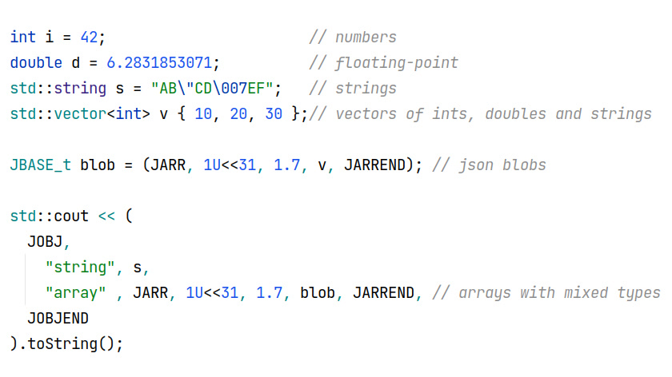

# cpp2json

Single statement JSON creation

### Welcome to the Wonderful World of JSON encoding

"cpp2json" is a single ".h" file that allows creation of JSON data using standard C++ operator overloading.

Supported data types: `int`, `double`, `string`, `vector<int>`, `vector<double>`, `vector<string>`.

Syntax is similar to JSON with keywords instead of symbols.

Replace:  
    "\[" with JARRBEG  
    "]" with JARREND  
    "{" with JOBJBEG  
    "}" with JOBJEND

## Example

```cpp
    JBASE_t blob = (JARRBEG, 1U<<31, 1.7, v, JARREND); // json blobs

    std::cout << (JOBJBEG,

        "first", JOBJBEG,
	    "number", i,
	    "vector", JARRBEG, 1U << 31, "AB\"CD\007EF", v, JARREND, // arrays with mixed types
        JOBJEND,
        "second", JOBJBEG,
            "float", d,
	    "blob", blob,
        JOBJEND,

    JOBJEND).toString() << "\n";
```

## Building

No need for autotools when building, `Makefile.am` is a regular makefile.  
Invoke with `make -f Makefile.am example`.

Autotools is used for its maintainer and distribution benefits.

If you like to build with autotools:

```
    ./autogen.sh    # optionally if autotools are not setup
    ./configure     # simple configure
    make            # 😊
```

## Source code

Grab one of the tarballs at [https://github.com/xyzzy/cpp2json/releases](https://github.com/xyzzy/cpp2json/releases) or checkout the latest code:

```sh
  git clone https://github.com/xyzzy/cpp2json.git
```

## Versioning

We use [SemVer](http://semver.org/) for versioning. For the versions available, see the [tags on this repository](https://github.com/xyzzy/cpp2json/tags).

## License

This project is licensed under MIT - see the [LICENSE.txt](LICENSE.txt) file for details.
